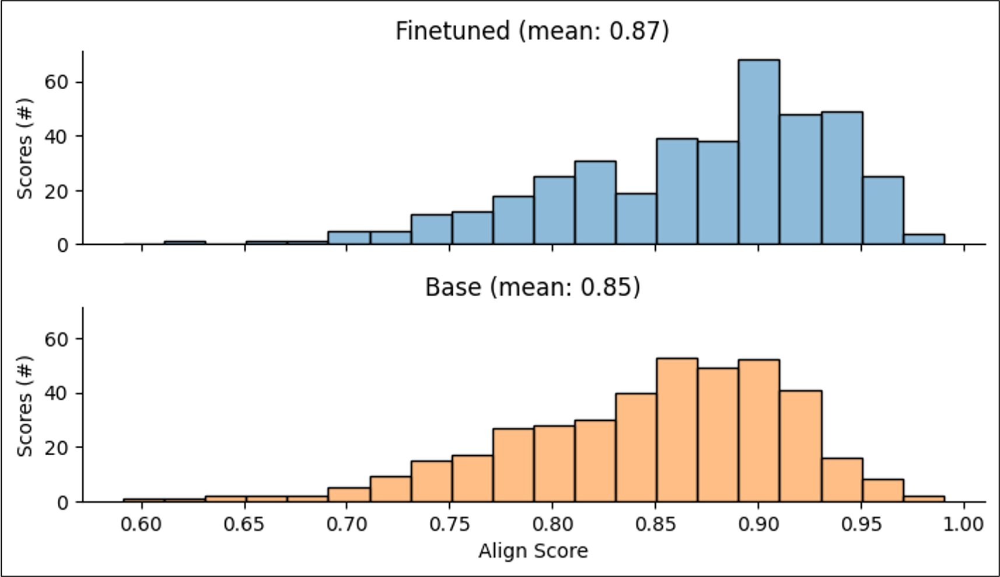

# Summary

In this work, we use Retrieval Augmented Fine-Tuning (RAFT) to fine-tune Llama 3, a large language model (LLM), using the textual corpora of 'omics-related literature harvested from publicly available databases and abstracts.
The resulting Llama 3-RAFT model accepts queries about biomolecules and returns relevant biological information (e.g., reaction pathways, function) based on the user-provided context and learned patterns from the RAFT fine tuning.

# Introduction

Advances in instrumentation have led to the increased and rapid collection of multiple ‘omics data (e.g., proteomics, genomics, metabolomics), paving the way for a more holistic understanding of biological systems and the detection of mechanisms leading to pathogenesis.

Several approaches have been developed that harmonize multi-omic data under unified modeling frameworks1-3. However, to interrogate these models beyond the predictions or sample groupings they generate, analysts must rely on i) variable importance methods (e.g., Shapley values4) to extract the most predictive/discriminatory set of modeled biomolecules, and ii) domain scientists (e.g., biologists) to contextualize the identified features within the modeled system based on their own knowledge or awareness/review of the relevant scientific literature.

LLMs provide an opportunity to improve the efficiency of the human-dependent aspect of model interrogation described in (ii). Specifically, domain-level experts may query a LLM for biological information on the indicated biomolecules and then judge and potentially revise generated responses for relevance and accuracy.

Many existing LLMs are general purpose, having been trained on the vast corpora of data available from social media and other public sources. Since these foundational LLMs were trained without the domain-specific language required by ‘omic-based queries, the aim of this work is to use RAFT (@zhang_raft_2024) to update an open-source, foundational LLM so that it may serve as an AI-assistant to the domain expert in their contextualization of important modeled features.

{#fig:workflow}

# Methods

Obtaining a domain-specific LLM is typically achieved through fine-tuning (FT) or retrieval-augmented generation (RAG). However, both approaches are limited:

- FT restricted to information within training data but requires no context
- RAG may retrieve irrelevant contextual documents, but is more generally applicable given its access to context documents

The RAFT approach is a combination of FT and RAG such that models can better retrieve relevant documents for queries by virtue of finetuning.

An overview of our development of a RAFT model is provided by Figure 1, and more detailed steps are provided below:

1. PubMed and UniProt data were scraped using their publicly available APIs.

2. These data were provided to GPT-4o with instructions to generate question-answer pairs to use as synthetic data.

- Context chunks were determined by grouping semantically similar text via a text embedding approach.

3. GPT-4o synthetic data was split into training evaluation subsets, with the training subset used to implement RAFT on Llama 3. An example question-answer pair used for RAFT training:

- Question: “[...] </DOCUMENT> What techniques were used to establish the protein composition of chromatographic fractions?”
- Answer: “[...] <ANSWER>: Two-dimensional polyacrylamide gel electrophoresis, N-terminal sequencing, endoproteinase Lys-C cleavage followed by peptide sequencing, comparison with ribosomal protein databases, and matrix-assisted laser-desorption ionization mass spectrometry (MALDI-MS).”

4. The evaluation subset was used to compare the performance of the RAFT-Llama 3 to the RAG-Llama 3 via the Align Score6.

- This score quantifies how well a response summarizes the informational content within reference document(s). The original input documents for each query were used as the reference documents in computing the align score for said query.

# Results

Figure 2 summarizes our work’s main comparison of interest. The distribution of the align score for the RAFT-Llama 3 model is depicted (in blue) above the corresponding distribution for the base Llama 3 model.

While both distributions appear largely similar, it should be noted that:

- Mean align score is slightly improved in the RAFT model relative to the base Llama 3
- In line with the improved mean, the RAFT distribution of align scores is more left skewed

Jointly, these results indicate that the RAFT model more typically generates responses that are marginally better aligned with the truth.

{#fig:results}

# Lessons Learned

Through our implementation and comparison of RAFT to a RAG approach, a few challenges were met:

1. Obtaining training data. Ideally, RAFT implementations are based on human-expert-curated, non-synthetic datasets of question-answer pairs. This kind of data was not available to us, prompting our generation and use of synthetic data based on real information.

2. Model Training/Computation Challenges. Large context chunks were sometimes difficult to load into GPU memory, forcing us to limit the generated context size. Long training/generation times for modestly sized datasets required careful checkpointing/monitoring.

3. LLM evaluation. Proper evaluation of any model requires a suitably large evaluation dataset, and in this context, a large evaluation dataset prohibits human-based evaluation. We instead relied on an automated metric, the Align Score, which has been benchmarked against other automated metrics on various datasets and assessed as best.

# Discussion

Our work found comparable performance between RAFT and RAG implementations of Llama 3 on ‘omics-based queries, with the RAFT implementation showing marginal improvement.

The align scores of each approach indicate a similar ability to summarize the original input documents that contain the information of interest, thereby demonstrating some promise in either approach for service as an AI-assistant to the inquiring ‘omics expert.

Importantly, these results were achieved based on synthetically generated data. These synthetic data were not verified for their fidelity to source truth, and thus it is entirely possible that better results may be obtained through a more involved curation of training data led by biological experts.

# Acknowledgements

We acknowledge contributions from [.PNNL Gen AI..]

# References
